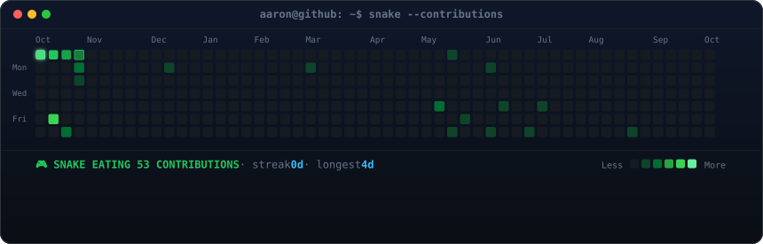
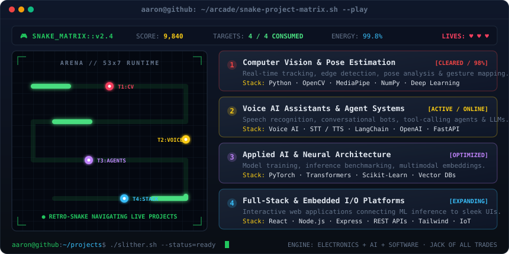

<div align="center">

<!-- Terminal Header: ASCII Portrait + Neofetch Info Card -->
<h3><code>aaron@github ~ $ whoami --verbose</code></h3>

<table border="0" cellspacing="0" cellpadding="0">
  <tr>
    <td valign="top" align="center">
      
    </td>
    <td valign="top" align="center">
      
    </td>
  </tr>
</table>

<br>
<br>

<!-- Live Snake Contribution Calendar -->
<h3><code>aaron@github ~ $ ./snake_contributions.sh --eat-food-loop</code></h3>



<br>
<br>

<!-- Snake Game Project Matrix -->
<h3><code>aaron@github ~ $ ./snake_matrix.sh --play</code></h3>



<br>
<br>

<!-- Terminal Applications Manifest -->
<h3><code>aaron@github ~ $ cat ./applications.json</code></h3>

</div>

```json
{
  "engineer": "Aaron Francis (@Niklaus2003)",
  "discipline": "Electronics & Communication Graduate blending Hardware, AI & Software",
  "applications": [
    {
      "module": "🎥 Computer Vision & Pose Tracking",
      "capabilities": "Real-time edge/feature detection, human pose estimation, and gesture mapping",
      "technologies": ["Python", "OpenCV", "MediaPipe", "PyTorch", "NumPy"]
    },
    {
      "module": "🎤 Voice AI & Autonomous Agents",
      "capabilities": "Voice-enabled personal assistants, speech recognition (STT/TTS), and agentic workflows",
      "technologies": ["Voice AI", "LLMs", "LangChain", "FastAPI", "STT/TTS"]
    },
    {
      "module": "🤖 Applied ML & Neural Systems",
      "capabilities": "Machine learning experimentation, inference benchmarking, and multimodal embeddings",
      "technologies": ["PyTorch", "Transformers", "Scikit-Learn", "Model Optimization"]
    },
    {
      "module": "🌐 Full-Stack & Embedded I/O Platforms",
      "capabilities": "Interactive web dashboards connecting embedded AI models to responsive frontend UIs",
      "technologies": ["React", "Node.js", "Express", "Tailwind CSS", "REST APIs", "IoT"]
    }
  ],
  "philosophy": "Creating is my way of learning, experimenting is my way of improving."
}
```

<div align="center">

<br>

<!-- Terminal Links & Social Badges -->
<h3><code>aaron@github ~ $ ./connect.sh</code></h3>

<p align="center">
  <a href="https://aaronfrancis.netlify.app/"></a>
  &nbsp;
  <a href="https://www.linkedin.com/in/aaron-francis-00b41727a"></a>
  &nbsp;
  <a href="mailto:aaronofficial19@gmail.com"></a>
  &nbsp;
  
</p>

<br>

<p align="center">
  <em>✨ Jack of all trades, forever curious 🌙</em>
</p>

</div>
